<p align="center">
  
  
  <h3 align="center"><strong>MultiCorrupt: A Multi-Modal Robustness Dataset and Benchmark of LiDAR-Camera Fusion for 3D Object Detection</strong></h3>

  <p align="center">
      <a href="https://google.com" target='_blank'>Till Beemelmanns</a><sup>1</sup>&nbsp;&nbsp;
      <a href="https://google.com" target='_blank'>Quan Zhang</a><sup>2</sup>&nbsp;&nbsp;
      <a href="https://google.com" target='_blank'>Lutz Eckstein</a><sup>1</sup>&nbsp;&nbsp;
    <br>
    <small><sup>1</sup>Institute for Automotive Engineering, RWTH Aachen University, Germany&nbsp;&nbsp;</small>
    <small><sup>2</sup>Department of Electrical Engineering and Computer Science, TU Berlin, Germany&nbsp;&nbsp;</small>
  </p>
</p>


> **Abstract:** Multi-modal 3D object detection models for autonomous driving have demonstrated exceptional performance on computer vision benchmarks like nuScenes. However, their reliance on densely sampled LiDAR point clouds and meticulously calibrated sensor arrays poses challenges for real-world applications. Issues such as sensor misalignment, miscalibration, and disparate sampling frequencies lead to spatial and temporal misalignment in data from LiDAR and cameras. Additionally, the integrity of LiDAR and camera data is often compromised by adverse environmental conditions such as inclement weather, leading to occlusions and noise interference. To address this challenge, we introduce MultiCorrupt, a comprehensive benchmark designed to evaluate the robustness of multi-modal 3D object detectors against ten distinct types of corruptions.

<!-- omit in toc -->
## Overview
- [Corruption Types](#corruption-types)
- [News](#news)
- [Benchmark Results](#benchmark-results)
- [Metrics](#metrics)
- [Installation](#installation)
- [Usage](#usage)
- [TODOs](#todos)
- [Contribution](#contribution)
- [Acknowledgments](#acknowledgments)
- [Citation](#citation)


## Corruption Types

### Missing Camera
| Severity Level 1                                       | Severity Level 2                                       | Severity Level 3                                       |
|--------------------------------------------------------|--------------------------------------------------------|--------------------------------------------------------|
| Multi-View:                                            | Multi-View:                                            | Multi-View:                                            |
| 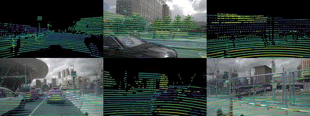 | 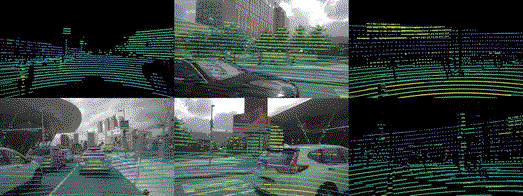 | 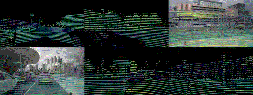 |

### Motion Blur
| Severity Level 1 | Severity Level 2 | Severity Level 3 |
|-------------------|-------------------|-------------------|
| BEV:              | BEV:              | BEV:              |
|  |  | 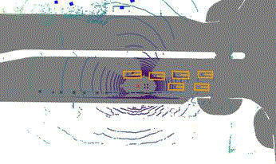 |
| Front:            | Front:            | Front:            |
| 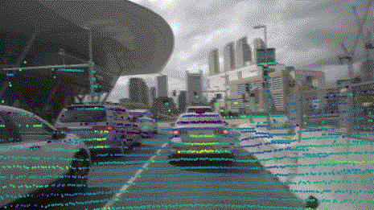 | 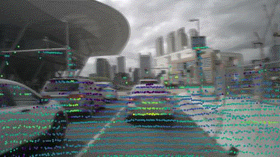 |  |

### Points Reducing
| Severity Level 1 | Severity Level 2 | Severity Level 3 |
|-------------------|-------------------|-------------------|
| BEV:              | BEV:              | BEV:              |
| 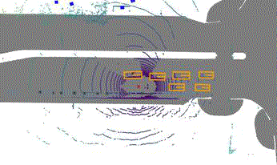 |  | 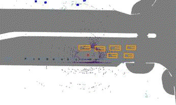 |
| Front:            | Front:            | Front:            |
| 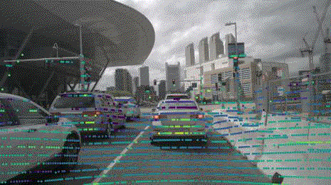 | 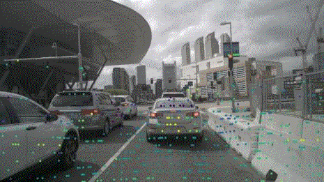 | 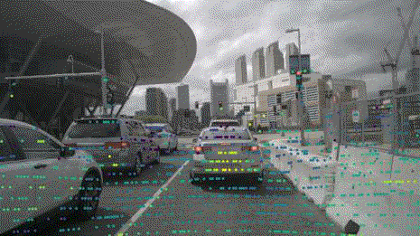 |

### Snow
| Severity Level 1 | Severity Level 2 | Severity Level 3 |
|-------------------|-------------------|-------------------|
| BEV:              | BEV:              | BEV:              |
| 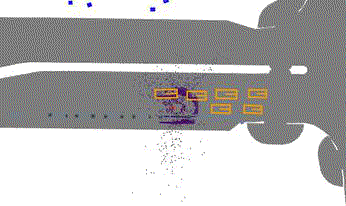 | 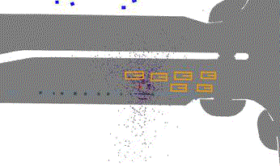 | 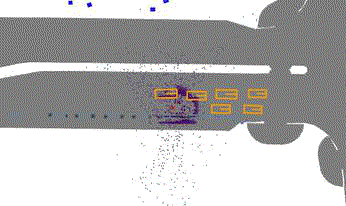 |
| Front:            | Front:            | Front:            |
| 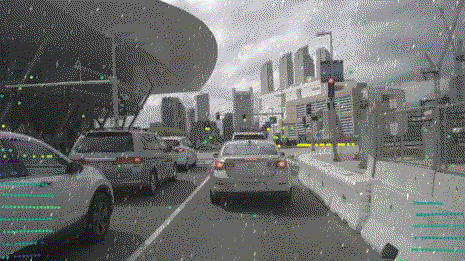 | 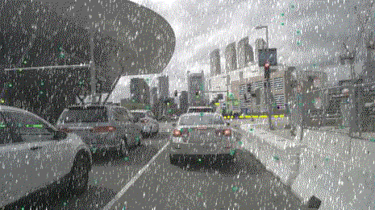 | 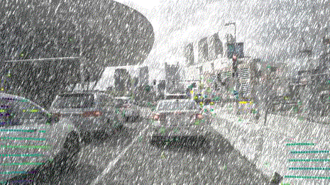 |

### Temporal Misalignment
| Severity Level 1 | Severity Level 2 | Severity Level 3 |
|-------------------|-------------------|-------------------|
| BEV:              | BEV:              | BEV:              |
|  |  |  |
| Multi-View:       | Multi-View:       | Multi-View:       |
| 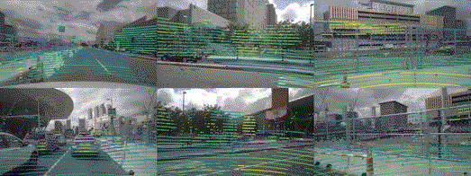 |  | 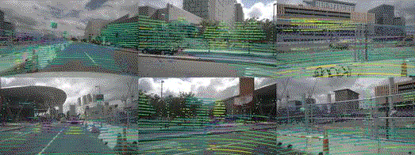 |

### Spatial Misalignment
| Severity Level 1 | Severity Level 2 | Severity Level 3 |
|-------------------|-------------------|-------------------|
| BEV:              | BEV:              | BEV:              |
|  |  |  |
| Multi-View:       | Multi-View:       | Multi-View:       |
| 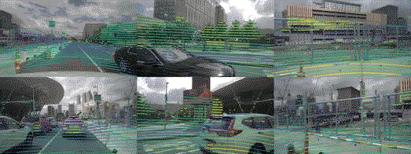 | 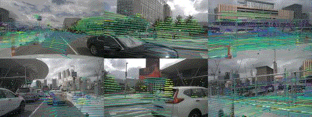 |  |

### Beams Reducing
| Severity Level 1 | Severity Level 2 | Severity Level 3 |
|-------------------|-------------------|-------------------|
| BEV:              | BEV:              | BEV:              |
| 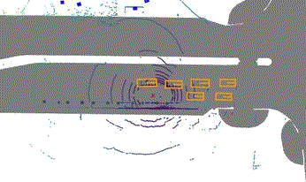 | 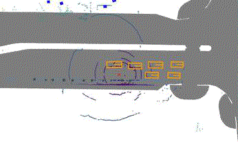 | 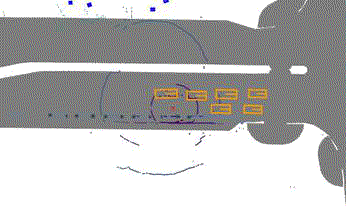 |
| Front:            | Front:            | Front:            |
| 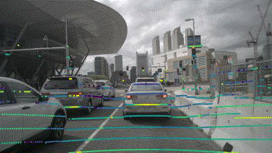 | 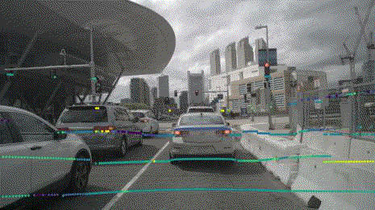 | 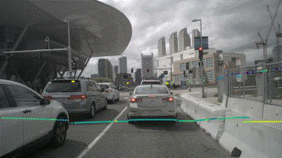 |

### Brightness
| Severity Level 1 | Severity Level 2 | Severity Level 3 |
|-------------------|-------------------|-------------------|
| Multi-View:       | Multi-View:       | Multi-View:       |
| 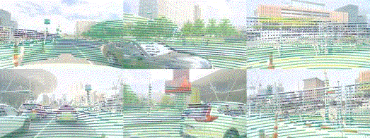 | 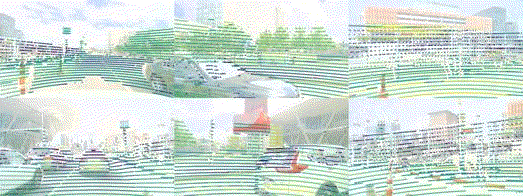 | 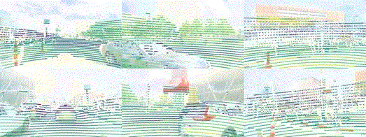 |

### Dark
| Severity Level 1 | Severity Level 2 | Severity Level 3 |
|-------------------|-------------------|-------------------|
| Multi-View:       | Multi-View:       | Multi-View:       |
| 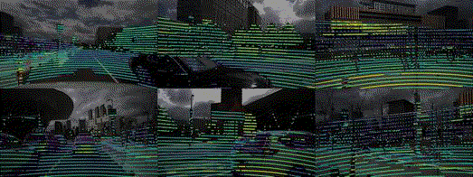 | 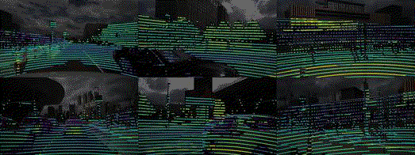 | 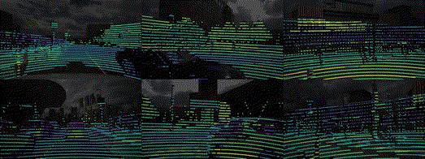 |

### Fog
| Severity Level 1 | Severity Level 2 | Severity Level 3 |
|-------------------|-------------------|-------------------|
| BEV:              | BEV:              | BEV:              |
| 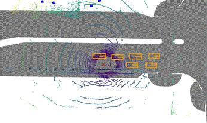 | 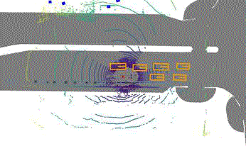 | 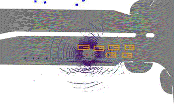 |
| Multi-View:       | Multi-View:       | Multi-View:       |
| 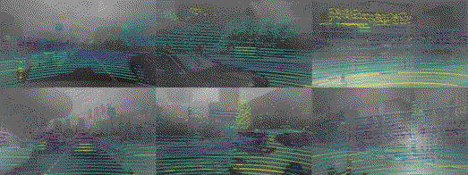 | 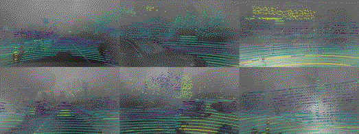 | 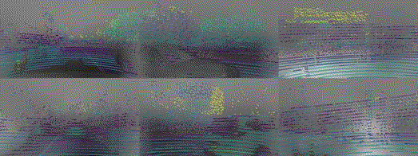 |


*Note: Right click and click on `Open Image in new tab` to enlarge an animation*

## News
- [01.02.2024] Initial Release with **10 corruption types** and **5 evaluated models**

## Benchmark Results
### Resistance Ability (RA) computed with NDS metric

| Model                                                           | Clean     | Beams Red.   | Brightness   | Darkness   | Fog       | Missing Cam.   | Motion Blur   | Points Red.   | Snow      | Spatial Mis.   | Temporal Mis.   | mRA       |
|:----------------------------------------------------------------|:----------|:-------------|:-------------|:-----------|:----------|:---------------|:--------------|:--------------|:----------|:---------------|:----------------|:----------|
| [CMT](https://github.com/junjie18/CMT)                          | 0.729     | **0.786**    | 0.985        | 0.948      | **0.806** | 0.974          | 0.841         | **0.925**     | **0.833** | **0.809**      | **0.788**       | **0.870** |
| [Sparsefusion](https://github.com/yichen928/SparseFusion)       | **0.732** | 0.689        | 0.992        | 0.963      | 0.767     | 0.954          | 0.848         | 0.879         | 0.770     | 0.714          | 0.777           | 0.835     |
| [BEVfusion](https://github.com/mit-han-lab/bevfusion)           | 0.714     | 0.676        | 0.987        | 0.969      | 0.752     | 0.974          | **0.866**     | 0.872         | 0.774     | 0.705          | 0.742           | 0.832     |
| [TransFusion](https://github.com/XuyangBai/TransFusion)         | 0.708     | 0.633        | **0.998**    | **0.988**  | 0.754     | **0.985**      | 0.826         | 0.851         | 0.748     | 0.685          | 0.777           | 0.824     |
| [DeepInteraction](https://github.com/fudan-zvg/DeepInteraction) | 0.691     | 0.655        | 0.984        | 0.929      | 0.583     | 0.842          | 0.832         | 0.882         | 0.759     | 0.731          | 0.768           | 0.796     |


### Relative Resistance Ability (RRA) computed with NDS metric and baseline BEVfusion
| Model                                                           | Clean     | Beams Red.   | Brightness   | Darkness   | Fog       | Missing Cam.   | Motion Blur   | Points Red.   | Snow      | Spatial Mis.   | Temporal Mis.   | mRRA      |
|:----------------------------------------------------------------|:----------|:-------------|:-------------|:-----------|:----------|:---------------|:--------------|:--------------|:----------|:---------------|:----------------|:----------|
| [BEVfusion](https://github.com/mit-han-lab/bevfusion)           | 0.714     | -----        | -----        | -----      | -----     | -----          | -----         | -----         | -----     | -----          | -----           | -----     |
| [CMT](https://github.com/junjie18/CMT)                          | 0.729     | **18.642**   | 1.821        | -0.096     | **9.398** | **2.041**      | -0.841        | **8.213**     | **9.887** | **17.053**     | **8.448**       | **7.457** |
| [Sparsefusion](https://github.com/yichen928/SparseFusion)       | **0.732** | 4.264        | **2.913**    | **1.821**  | 4.429     | 0.297          | **0.280**     | 3.242         | 1.887     | 3.699          | 7.228           | 3.006     |
| [TransFusion](https://github.com/XuyangBai/TransFusion)         | 0.708     | -7.210       | 0.270        | 1.146      | -0.552    | 0.340          | -5.412        | -3.296        | -4.220    | -3.626         | 3.850           | -1.871    |
| [DeepInteraction](https://github.com/fudan-zvg/DeepInteraction) | 0.691     | -6.361       | -3.551       | -7.215     | -25.037   | -16.386        | -7.077        | -2.188        | -5.149    | 0.212          | 0.145           | -7.261    |

## Metrics
We adhere to the official nuScenes metric definition for computing the NDS and mAP metrics on the MultiCorrupt dataset. To quantitatively compare the performance between the corrupted dataset and the clean nuScenes datasets, we use a metric called the *Resistance Ability* (RA). This metric is calculated across the different severity levels with 

$$RA_{c,s} = \frac{MET_{c,s}}{MET_{clean}}, RA_c = \frac{1}{3} \sum_{s=1}^{3} RA_{c,s}$$

$$mRA = \frac{1}{N} \sum_{c=1}^{N} RA_c$$

where  $MET_{c,s}$  represents metric for the $c$ types of corruption at the $s$-the severity level, $N$ is the total number of corruption types considered in our benchmark, and $ MET_{clean} $ is performance on the "clean" nuScenes dataset.

*Relative Resistance Ability* ( $RRA_{c}$ ) compares the relative robustness of each model for a specific type of corruption with a baseline model. If the value is greater than zero, it indicates that the model demonstrates superior robustness compared to the baseline model. If the value is less than zero, it suggests that the model is less robust than the baseline. We can summarize the relative resistance by computing *Mean Relative Resistance Ability* (mRRA), which measures the relative robustness of the candidate model compared to a baseline model for all types of corruptions

$$RRA_{c} = \frac{\sum\limits_{i=1}^{3} (MET_{c, s})}{\sum\limits_{i=1}^{3} (MET_{baseline, c, s})} - 1,$$


$$mRRA = \frac{1}{N} \sum_{i=1}^{N} RRA_c.$$

where $c$ denotes the type of corruption, $s$ represents the level of severity, and $N$ is the total number of corruption types considered in our benchmark. The term $RRA_{c}$ specifically illustrates the relative robustness of each model under a particular type of corruption $c$. The $mRRA$ reflects the global perspective by showing the average robustness of each model across all considered types of corruption with the baseline model.


## Installation

#### Clone this repository:

```bash
git clone https://github.com/ika-rwth-aachen/MultiCorrupt.git
cd multicorrupt
```

#### Build the Docker image:

```bash
cd docker
docker build -t multicorrupt_create -f Dockerfile.data .
```

#### Download Snowflakes
We use [LiDAR_snow_sim](https://github.com/SysCV/LiDAR_snow_sim) to simulate snow in LiDAR point clouds. To make the
snow simulation run we need to download the snowflakes:

```bash
cd converter
wget https://www.trace.ethz.ch/publications/2022/lidar_snow_simulation/snowflakes.zip
unzip snowflakes.zip
rm snowflakes.zip
```


## Usage

### Image Corruption Generation

Run the following script to generate a corrupted image dataset:

```bash
converter/img_converter.py
```

Inside the script, you can customize the parameters:

```bash
--corruption: Choose the corruption type from 'snow', 'fog', 'temporalmisalignment', 'brightness', 'dark', 'missingcamera', 'motionblur'.
--root_folder: The directory of the nuScenes dataset.
--dst_folder: The destination folder for the generated dataset.
--severity: Severity level {1, 2, 3}.
--n_cpus: Number of CPUs to use for processing.
```

### Example

```bash
python converter/img_converter.py \
--corruption snow \
--root_folder /workspace/data/nuscenes \
--dst_folder /workspace/multicorrupt/snow/3 \
--severity 3 \
--n_cpus 24
```

### LiDAR Corruption Generation

Run the following script to generate a corrupted image dataset:

```bash
converter/lidar_converter.py
```

```bash
--corruption: Choose the corruption type from 'pointsreducing', 'beamsreducing', 'snow', 'fog', 'copy', 'spatialmisalignment', 'temporalmisalignment', 'motionblur'.
--sweep: If apply for sweep LiDAR (true/false).
--root_folder: The directory of the nuScenes dataset.
--dst_folder: The destination folder for the generated dataset.
--severity: Severity level {1, 2, 3}.
--n_cpus: Number of CPUs to use for processing.
```

### Example

```bash
python3 converter/lidar_converter.py \
--corruption snow \
--root_folder /workspace/data/nuscenes \
--dst_folder /workspace/multicorrupt/snow/3/ \
--severity 3 \
--n_cpus 64 \
--sweep true
```

## TODOs
- [ ] Add more visualization
- [ ] Add contribution guidelines

## Contribution
- **Coming Soon**
    - How to contribute
    - How to add a model to the benchmark


## Acknowledgments
We thank the authors of

- [mmdetection3d](https://github.com/open-mmlab/mmdetection3d)
- [LiDAR_fog_sim](https://github.com/MartinHahner/LiDAR_fog_sim)
- [LiDAR_snow_sim](https://github.com/SysCV/LiDAR_snow_sim)
- [lidar-camera-robust-benchmark](https://github.com/kcyu2014/lidar-camera-robust-benchmark)
- [RoboBEV](https://github.com/Daniel-xsy/RoboBEV)
- [Robo3D](https://github.com/ldkong1205/Robo3D)

for their open source contribution which made this project possible.

---

|  | This work has received funding from the European Union’s Horizon Europe Research and Innovation Programme under Grant Agreement No. 101076754 - [AIthena project](https://aithena.eu/). |
|:--------------------------------------------------:|----------------------------------------------------------------------------------------------------------------------------------------------------------------------------------|


## Citation
```
TBD
```
